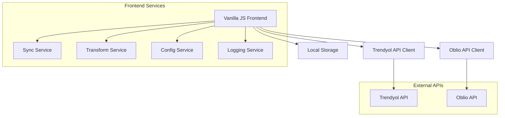

# Design Document

## Overview

The Trendyol-Oblio Invoice Integration is a frontend-only web application that provides manual control for creating invoices in Oblio accounting software based on orders from Trendyol marketplace. The application runs entirely in the browser, giving users full control over the synchronization process without requiring a backend server.

The integration workflow consists of:
1. User manually triggers fetching orders without invoices from Trendyol API
2. Displaying orders in a user-friendly interface for review
3. User selects which orders to process
4. Transforming selected order data to Oblio invoice format
5. Creating invoices in Oblio with user confirmation
6. Sending invoice link back to Trendyol
7. Displaying results and maintaining local session state

## Architecture

### System Architecture



### Technology Stack

- **Frontend**: Vanilla JavaScript with TypeScript
- **HTTP Client**: Fetch API for API communications
- **UI Styling**: CSS3 with modern features
- **Validation**: Custom validation functions
- **Storage**: Browser Local Storage for configuration and session data
- **Build Tool**: TypeScript compiler (tsc) for compilation

## Components and Interfaces

### 1. UI Components

**Main UI Modules:**
- `App` - Main application controller and DOM manipulation
- `Dashboard` - Main interface showing sync status and controls
- `OrdersList` - Display orders fetched from Trendyol with selection
- `InvoicePreview` - Preview transformed invoice before creation
- `ConfigurationPanel` - Manage API credentials and settings
- `SyncLogs` - Display operation logs and results
- `LoadingSpinner` - Reusable loading indicator

### 2. Trendyol API Client

**Key Methods:**
```typescript
interface TrendyolClient {
  getAllShipmentPackages(): Promise<TrendyolShipmentPackage[]>
  sendInvoiceLinkToOrder(shipmentPackageId: number, invoiceLink: string): Promise<void>
  validateCredentials(): Promise<boolean>
}

interface TrendyolInvoiceLinkRequest {
  invoiceLink: string
  shipmentPackageId: number
}
```

interface ShipmentPackageParams {
  page?: number
  size?: number
  orderByField?: 'PackageLastModifiedDate' | 'CreatedDate'
  orderByDirection?: 'ASC' | 'DESC'
}

interface ShipmentPackageResponse {
  content: TrendyolShipmentPackage[]
  page: number
  size: number
  totalElements: number
  totalPages: number
}
```

**API Endpoints Used:**
- `GET https://apigw.trendyol.com/integration/order/sellers/{sellerId}/orders` - Fetch shipment packages
- `POST https://apigw.trendyol.com/integration/sellers/{sellerId}/seller-invoice-links` - Send invoice link to order

**Authentication:**
- Basic Authentication using API Key and API Secret
- Required Headers:
  - `User-Agent: {supplierId} - SelfIntegration`
  - `storeFrontCode: {storeFrontCode}` (e.g., "TR" for Turkey, "INT" for International)

**Query Parameters for Shipment Packages:**
- `page` - Page number (default: 0)
- `size` - Page size (default: 200, max: 200)
- `orderByField` - Sort field (PackageLastModifiedDate, CreatedDate)
- `orderByDirection` - Sort direction (ASC, DESC)

**Note:** The API does not provide a direct filter for orders without invoice links. The application will:
1. Fetch all shipment packages using pagination (regardless of status)
2. Check each package client-side to determine if it has an invoice link
3. Filter out packages that already have invoice links assigned
4. Present remaining packages for invoice creation

**API Documentation Reference:**
- International Order V2 API: https://developers.trendyol.com/int/docs/international-marketplace/international-order-v2/int-getShipmentPackages
- Invoice Link Integration: https://developers.trendyol.com/int/docs/international-marketplace/invoice-integration/int-send-invoice-link

### 3. Oblio API Client

**Key Methods:**
```typescript
interface OblioClient {
  createInvoice(invoiceData: OblioInvoiceRequest): Promise<OblioInvoiceResponse>
  validateCredentials(): Promise<boolean>
  getInvoiceById(docId: string): Promise<OblioInvoice>
  getCompanies(): Promise<OblioCompany[]>
}
```

**Note:** The `createInvoice` method returns an `OblioInvoiceResponse` that includes the invoice link directly in the response data. No separate API call is needed to get the invoice link.

**API Endpoints Used:**
- `POST https://www.oblio.eu/api/docs/invoice` - Create invoice
- `GET https://www.oblio.eu/api/docs/invoice/{docId}` - Get invoice details
- `GET https://www.oblio.eu/api/companies` - Get companies list

**Authentication:**
- Email and Secret Key authentication
- Headers: `Authorization: {email} {secret_key}`

API ref:
https://www.oblio.eu/api#overview

### 4. Frontend Services

**Sync Service:**
```typescript
interface SyncService {
  fetchAllShipmentPackages(): Promise<TrendyolShipmentPackage[]>
  filterPackagesWithoutInvoices(packages: TrendyolShipmentPackage[]): TrendyolShipmentPackage[]
  processSelectedPackages(packageIds: string[]): Promise<SyncResult>
  retryFailedInvoice(packageId: string): Promise<void>
  checkInvoiceStatus(package: TrendyolShipmentPackage): boolean
}
```

**Manual Workflow:**
1. User clicks "Fetch All Shipment Packages" button
2. System fetches all packages using pagination (regardless of status)
3. Filter client-side for packages without invoice links (excluding "Awaiting" status)
4. Display filtered shipment packages in a table with checkboxes
5. User reviews and selects which packages need invoices
6. User clicks "Create Invoices" button
7. For each selected package:
   - Create invoice in Oblio (response includes invoice link)
   - Send invoice link to Trendyol
8. Show progress and results for each shipment package
9. Allow retry for failed invoice creations

**Invoice Link Detection:**
- Check if package already has an invoice link associated (via local tracking)
- Maintain local storage of processed packages with their invoice links to avoid duplicates
- Provide manual override option for edge cases
- Filter out packages with status "Awaiting" (should only be used for stock transactions)
- Note: Package status ("Invoiced", "Shipped", etc.) does not guarantee an invoice link exists

### 5. Data Transformation Service

**Mapping Logic:**
```typescript
interface TransformService {
  trendyolOrderToOblioInvoice(order: TrendyolOrder): OblioInvoiceRequest
  validateTransformedData(invoice: OblioInvoiceRequest): ValidationResult
}
```

**Field Mappings:**
- Order ID → Invoice Reference
- Customer Info → Client Details
- Order Items → Invoice Line Items
- Pricing → Tax calculations
- Dates → Invoice dates

## Data Models

### Local Storage Schema

**Storage Strategy:**
- **Encrypted Local Storage**: API credentials and sensitive configuration
- **Plain Local Storage**: UI preferences and non-sensitive settings
- **Session Storage**: Temporary data that should not persist between sessions

**Configuration Storage (Encrypted in Local Storage):**
```typescript
interface EncryptedConfig {
  trendyol: {
    apiKey: string // Encrypted
    secretKey: string // Encrypted
    supplierId: string
    storeFrontCode: string // "TR", "INT", etc.
  }
  oblio: {
    email: string
    secretKey: string // Encrypted
    cif: string // Company CIF for invoice creation
    workStation: number // Default work station
  }
}
```

**App Settings (Plain Local Storage):**
```typescript
interface AppSettings {
  autoRetryCount: number
  theme: 'light' | 'dark'
  lastConfigUpdate: string
  uiPreferences: {
    tablePageSize: number
    defaultView: string
  }
}
```

**Session Data (Session Storage):**
```typescript
interface SessionData {
  currentShipmentPackages: TrendyolShipmentPackage[]
  processedInvoices: ProcessedInvoice[]
  syncLogs: LogEntry[]
  lastFetchTime: string
  selectedPackageIds: string[]
}

interface ProcessedInvoice {
  trendyolOrderId: string
  oblioInvoiceId?: string
  oblioInvoiceLink?: string
  status: 'pending' | 'completed' | 'failed'
  errorMessage?: string
  processedAt: string
}
```

**Storage Keys:**
- `trendyol-oblio-config-encrypted` - Encrypted API credentials
- `trendyol-oblio-settings` - App settings and preferences
- `trendyol-oblio-session` - Current session data (Session Storage)

**Encryption Implementation:**
```typescript
interface StorageService {
  encryptAndStore(key: string, data: any): Promise<void>
  decryptAndRetrieve(key: string): Promise<any>
  clearSensitiveData(): void
  exportConfig(): string // For backup
  importConfig(configString: string): Promise<void>
}
    autoRetryCount: number
  }
}
```

**Session Storage:**
```typescript
interface SessionData {
  currentShipmentPackages: TrendyolShipmentPackage[]
  processedInvoices: ProcessedInvoice[]
  syncLogs: LogEntry[]
  lastFetchTime: string
}

interface ProcessedInvoice {
  trendyolOrderId: string
  oblioInvoiceId?: string
  oblioInvoiceLink?: string
  status: 'pending' | 'completed' | 'failed'
  errorMessage?: string
  processedAt: string
}
```

### TypeScript Interfaces

```typescript
// Trendyol Models (based on API documentation)
interface TrendyolShipmentPackage {
  id: number // shipmentPackageId - this is what we send to Trendyol invoice API
  orderNumber: string
  orderDate: number // timestamp in milliseconds GMT +3
  originShipmentDate: number // timestamp - date of transfer to seller
  lastModifiedDate: number // last status update date
  shipmentPackageStatus: string // "Created", "Picking", "Invoiced", "Shipped", "Delivered", etc.
  status: string // same as shipmentPackageStatus
  deliveryType: string
  agreedDeliveryDate: number
  estimatedDeliveryStartDate: number
  estimatedDeliveryEndDate: number
  grossAmount: number
  totalPrice: number
  totalDiscount: number
  totalTyDiscount: number
  taxNumber: string | null
  currencyCode: string
  invoiceAddress: TrendyolAddress
  shipmentAddress: TrendyolAddress
  customerFirstName: string
  customerLastName: string
  customerEmail: string
  customerId: number
  identityNumber: string
  packageHistories: PackageHistory[]
  cargoTrackingNumber: number
  cargoTrackingLink: string
  cargoSenderNumber: string
  cargoProviderName: string
  lines: PackageLine[]
  warehouseId: number
  createdBy: string // "order-creation", "cancel", "split", "transfer"
}

interface TrendyolAddress {
  id: number
  firstName: string
  lastName: string
  company: string
  address1: string
  address2: string
  addressLines?: {
    addressLine1: string
    addressLine2: string
  }
  city: string
  cityCode: number
  district: string
  districtId: number
  countyId?: number // eligible for CEE region
  countyName?: string // eligible for CEE region
  shortAddress?: string // eligible for Gulf region
  stateName?: string // eligible for Gulf region
  postalCode: string
  countryCode: string
  neighborhoodId: number
  neighborhood: string
  phone: number
  latitude?: string
  longitude?: string
  fullAddress: string
  fullName: string
}

interface PackageHistory {
  createdDate: number // timestamp
  status: string // "Awaiting", "Created", "Picking", "Invoiced", "Shipped", "Delivered", etc.
}

interface PackageLine {
  id: number // orderLineId
  quantity: number
  salesCampaignId: number
  productSize: string
  merchantSku: string // stockCode
  productName: string
  productCode: number // variantId
  productOrigin: string
  merchantId: number // sellerId
  amount: number // total price of the line
  price: number // unit price
  discount: number // total discount of the line
  tyDiscount: number // always 0.00 for international orders
  discountDetails: DiscountDetail[]
  currencyCode: string
  productColor: string
  sku: string // same as barcode
  barcode: string
  vatBaseAmount: number // vatRate
  orderLineItemStatusName: string
  productCategoryId: number
  commission: number
}

interface DiscountDetail {
  lineItemPrice: number
  lineItemDiscount: number
  lineItemTyDiscount: number // always 0.00 for international orders
}

// Oblio Models (based on API documentation)
interface OblioInvoiceRequest {
  cif: string
  client: OblioClient
  issueDate: string
  dueDate: string
  currency: string
  language: string
  workStation: number
  seriesName: string
  useStock: number
  products: OblioProduct[]
  issuerName?: string
  issuerId?: string
  noticeNumber?: string
  internalNote?: string
  deputyName?: string
  deputyIdentityCard?: string
  deputyAuto?: string
  selesAgent?: string
  mentions?: string
  value?: number
  collect?: OblioCollect
}

interface OblioClient {
  cif: string
  name: string
  rc?: string
  code?: string
  address?: string
  state?: string
  city?: string
  country?: string
  iban?: string
  bank?: string
  email?: string
  phone?: string
  contact?: string
  vatPayer?: boolean
}

interface OblioProduct {
  name: string
  code?: string
  description?: string
  price: number
  measuringUnit?: string
  currency?: string
  vatName?: string
  vatPercentage?: number
  vatIncluded?: boolean
  quantity: number
  productType?: string
}

interface OblioInvoiceResponse {
  status: number
  statusMessage: string
  data: {
    seriesName: string
    number: string
    link: string // Direct URL to the invoice PDF - this is what we send to Trendyol
  }
}

interface OblioInvoice {
  docId: string
  seriesName: string
  number: string
  link: string
  issueDate: string
  dueDate: string
  value: number
  currency: string
  status: string
}

interface OblioCompany {
  cif: string
  name: string
  vatPayer: boolean
  anaf: boolean
  vatOnCollection: boolean
  country: string
}

interface OblioWorkStation {
  workStation: number
  name: string
}

// Internal Models
interface SyncResult {
  syncId: string
  totalOrders: number
  successCount: number
  failureCount: number
  errors: SyncError[]
}
```

## Error Handling

### Error Categories

1. **API Errors**
   - Network timeouts
   - Authentication failures
   - Rate limiting
   - Invalid responses

2. **Data Errors**
   - Validation failures
   - Missing required fields
   - Format inconsistencies

3. **Business Logic Errors**
   - Duplicate invoices (HTTP 409 from Trendyol)
   - Invoice link already used for another package (HTTP 409 from Trendyol)
   - Invalid order states
   - Currency mismatches

4. **Trendyol-Specific Errors**
   - HTTP 409: Invoice already exists for shipment package
   - HTTP 409: Invoice link already used for different shipment package

### Retry Strategy

```typescript
interface RetryConfig {
  maxRetries: 3
  backoffStrategy: 'exponential' // 1s, 2s, 4s
  retryableErrors: ['NETWORK_ERROR', 'RATE_LIMIT', 'SERVER_ERROR']
}
```

### Error Response Format

```typescript
interface ErrorResponse {
  error: {
    code: string
    message: string
    details?: any
    timestamp: string
    requestId: string
  }
}
```

## Testing Strategy

### Unit Tests
- API client methods with mocked HTTP responses
- Data transformation logic with various input scenarios
- React component rendering and user interactions
- Validation functions with edge cases
- Error handling with different error types

### Integration Tests
- End-to-end user workflows with test APIs
- Local storage operations and data persistence
- Configuration management
- Retry logic with simulated failures

### DOM Tests
- DOM manipulation and event handling
- User interaction flows (clicking, selecting, form submission)
- State management and UI updates
- Error handling and user feedback

### Test Data Management
- Mock Trendyol orders with various scenarios
- Sample Oblio invoice responses
- Test configuration sets
- Fetch API mocking for testing

## Security Considerations

### API Credentials Management
- Store credentials encrypted in browser Local Storage
- Use Web Crypto API for client-side encryption of sensitive data
- Implement credential validation before use
- Clear sensitive data on logout/session end
- Provide option to export/import configuration for backup

### Data Protection
- Encrypt sensitive customer data in Local Storage using Web Crypto API
- Use HTTPS for all API communications
- Implement client-side data masking for logs
- Store non-sensitive UI preferences in Local Storage (unencrypted)
- Regular security audits of dependencies

### Client-Side Security
- Input validation and sanitization
- XSS prevention through proper DOM manipulation
- Content Security Policy (CSP) headers
- Secure handling of API responses

## Performance Considerations

### Optimization Strategies
- Lazy loading of order data
- Debounced API calls to prevent excessive requests
- Local caching of fetched orders during session
- Optimistic UI updates with rollback on errors

### User Experience
- Real-time progress indicators for long operations
- Bulk selection/deselection of orders
- Keyboard shortcuts for common actions
- Responsive design for mobile devices

### Browser Compatibility
- Modern browser support (Chrome, Firefox, Safari, Edge)
- Progressive enhancement for older browsers
- Graceful degradation of advanced features
- Local storage fallbacks